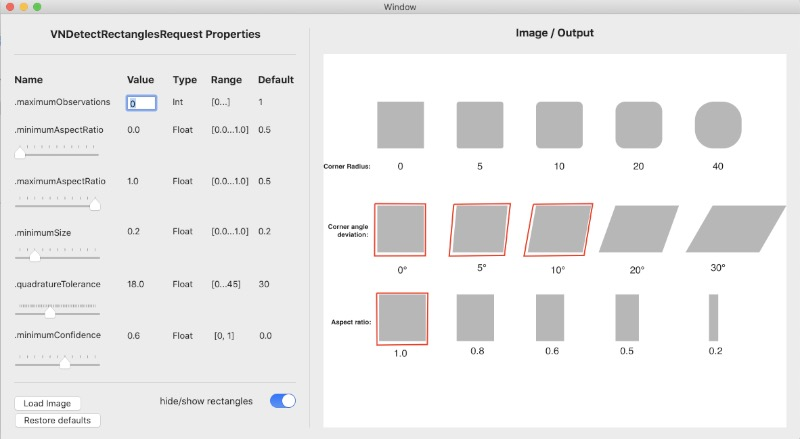

#  ExploringRectangleDetection

## About
This is a sample XCode project that can be used to explore how various parameter settings of VNDetectRectanglesRequest affect output.

To learn more, read the related [blogpost](https://www.dabblingbadger.com/blog/2020/2/10/rectangle-detection).
* Developed using XCode 11.3.1
