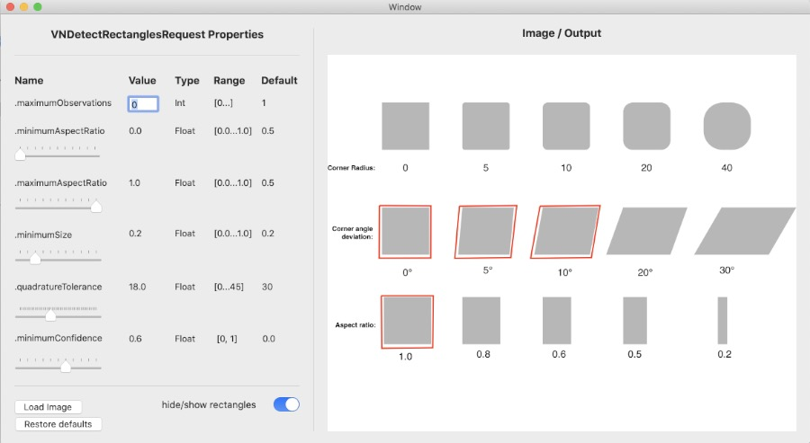

#  ExploringRectangleDetection

## About
Apple's Vision framework provides a number of useful tools for performing tasks such as face detection, barcode scanning, and text recognition on still images.  This sample project focuses on VNDetectRectanglesRequest.  You can compile this app and use your own images explore how various parameter settings affect request results.

To learn more about rectangle detection read the related [blogpost](https://www.dabblingbadger.com/blog/2020/2/10/rectangle-detection).
* Developed using XCode 11.3.1
